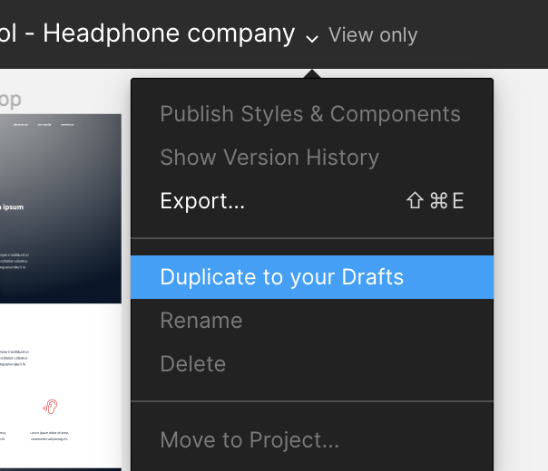

# CSS Advanced

This project adds CSS to the headphone company page built in html_advanced. The goal is to match the Figma design: colors, fonts, spacing and layout with Flexbox.

## Sections styled

- Header and banner
- Quotes
- Videos list
- Membership
- FAQ and footer

## Design

